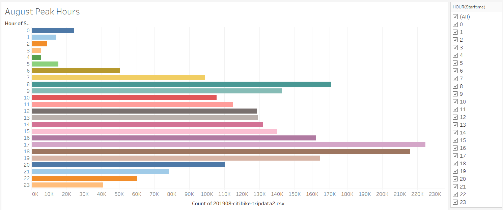
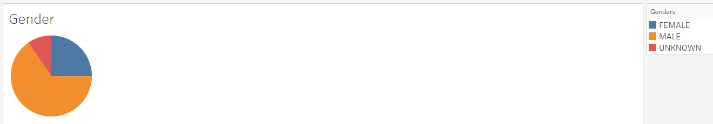
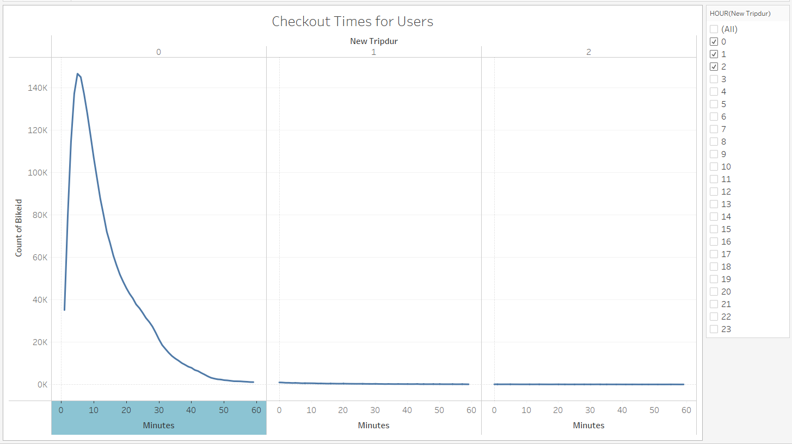
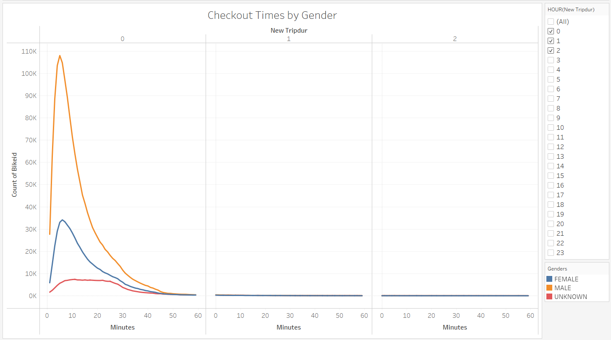
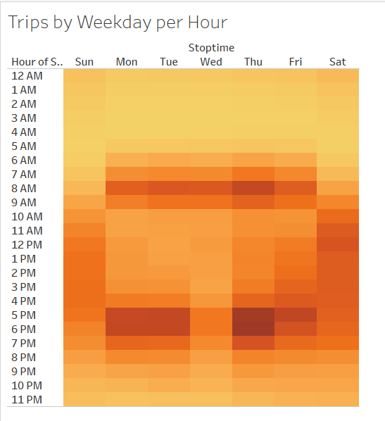
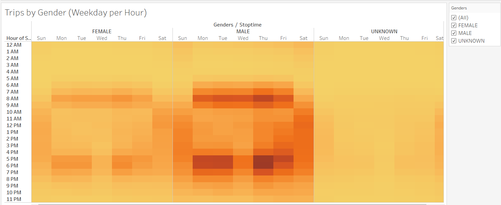
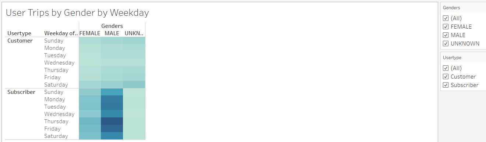
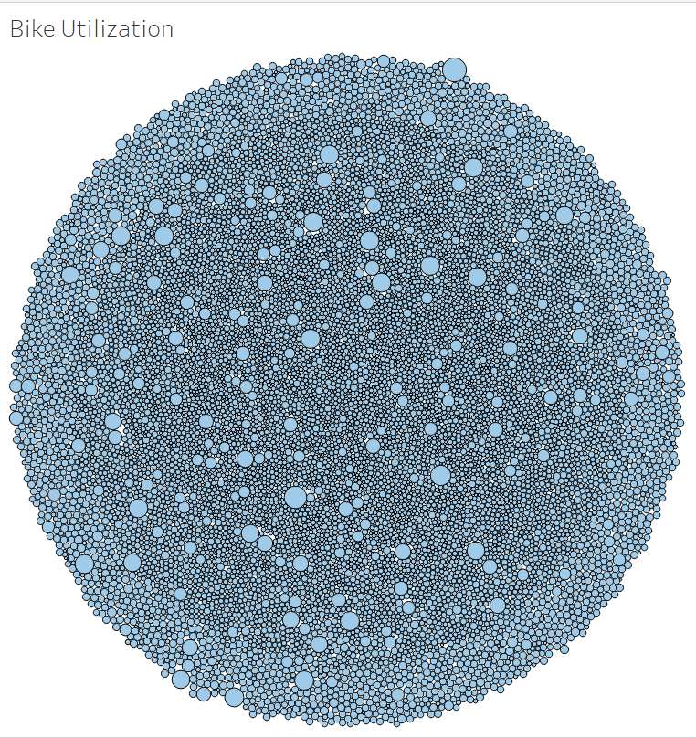

# Bikesharing

## Overview
This is an analysis of NYC Citi Bike bike-sharing program.

## Purpose
The purpose of this analysis is to determine the viability of bike-sharing program in Des Moines, IA using data, for August, from NYC Citi Bike which operates a successful bike-sharing program in New York, NY.

## Results

### Peak Hours
We'll start off by taking a look at the Peak hours.

Here we can see that 8AM and 5-6PM are the busiest times.

### Customer Genders
Lets take a look at a gender breakdown of NYC Citi Bike customers.

Here we see that Males are reflected the most in this dataset.

### Checkout Times
Next is Checkout Times or durations

Here we see that the trips are very long with the majorioty of them being less than 10 minutes.

#### Gender breakdown

If we break the data down by Gender...

We see that both genders have similar curves with the majority of durations for each gender is still less than 10 minutes.

### Trips by Weekday
Let's compare the number of trips by the days of the week.

Here we can see the pattern similar to the Peak Hours chart, with 8AM and 5=6PM being the darkest indicating the most number of trips.

#### Gender Breakdon
Now lets at the number of trips by weekday and by gender.

Again we see similar patterns for each gender, with the MALE being darkest.

#### User Type Breakdown
Now lets consider the number of trips by weekday, by gender, and now also by User Type(i.e., Subcriber or One-Off Customer).

This quite clearly demonstrates that Male Subscribers took the most trips.

### Bike Utilization
Let's take a look at the bike utilization to better understand the maintenance needs.

With the size of the circle indicating the number of trips each bike has been ridden, we can see that there will be fairly constant and wide ranging needs for upkeep and maintenance.

### Link to Dashboard
[Link to Dashboard](https://public.tableau.com/app/profile/paul.erickson/viz/NYCCitiBikeAnalysis_16493843953430/NYCCitiBikeStory?publish=yes)

### Summary
It is clear from this analysis that the success of the NYC Citi Bike bike-sharing program is due to the consistent participation of their Male subscribers. Given that most of the trips are short duration and happen during peak commuter hours, an analysis of Des Moines' commuter environment could help determine if there are similar needs. Also, compiling some data about the reason for each trip would be helpful in understanding if there are similar needs in Des Moines.